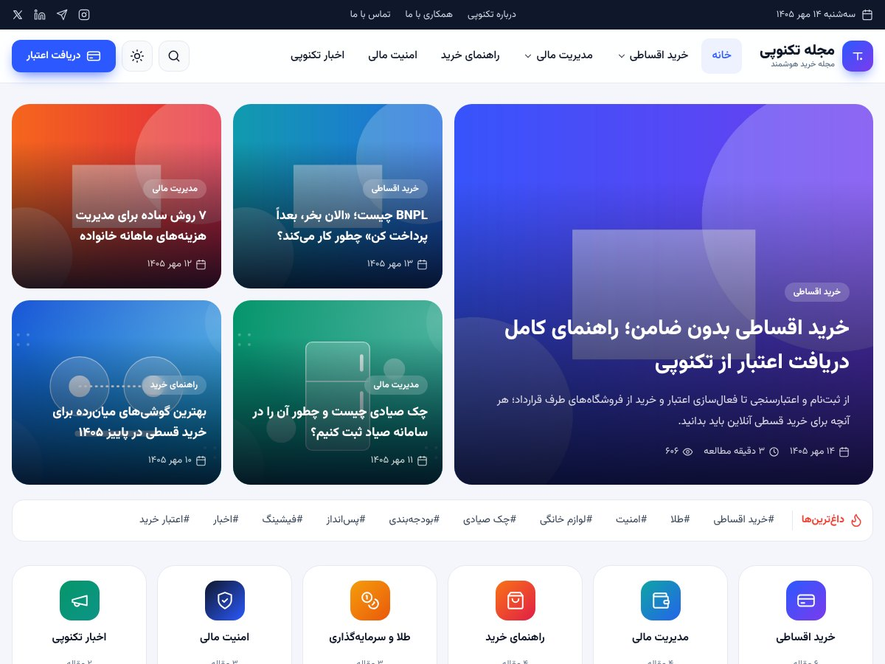

<div dir="rtl">

# قالب وردپرس «مجله تکنوپی» (TechnoPay Mag)

قالب مجله/بلاگ فارسی و راست‌چین برای وبلاگ تکنوپی؛ با صفحه اصلی مجله‌ای، حالت تاریک، فهرست مطالب خودکار، محاسبه‌گر اقساط، تاریخ شمسی و فونت وزیرمتن (بدون وابستگی به CDN).



## امکانات

- **صفحه اصلی مجله‌ای** با بخش‌های قابل روشن/خاموش‌کردن:
  مطالب ویژه (نوشته‌های سنجاق‌شده در اولویت‌اند)، نوار «داغ‌ترین‌ها» (برچسب‌ها)، کاشی دسته‌بندی‌ها، آخرین مطالب با تب دسته‌ها + سایدبار، بنر دریافت اعتبار، بلوک دسته ویژه، مراحل دریافت اعتبار، دو ستون دسته‌ها و خبرنامه.
- **صفحه نوشته**: نوار پیشرفت مطالعه، فهرست مطالب خودکار (از تیترهای H2/H3)، زمان مطالعه، شمارنده بازدید، اشتراک‌گذاری (تلگرام، واتس‌اپ، ایکس، لینکدین، کپی لینک)، باکس نویسنده، مطلب قبلی/بعدی، دیدگاه‌های تودرتو و مطالب مرتبط.
- **آرشیو دسته/برچسب/نویسنده و جستجو** با مرتب‌سازی (جدیدترین، پربازدیدترین، پربحث‌ترین) و نمایش لیستی/شبکه‌ای.
- **ابزارک‌های اختصاصی**: پربازدیدترین‌ها، محاسبه‌گر اقساط، بنر دریافت اعتبار.
- **الگوهای بلوک (Patterns)** برای ویرایشگر: باکس نکته، باکس هشدار، باکس دعوت به دریافت اعتبار و سوالات متداول آکاردئونی.
- **حالت تاریک** (خودکار بر اساس سیستم‌عامل + دکمه تغییر دستی).
- **تاریخ شمسی** داخلی (اگر افزونه پارسی‌دیت فعال باشد، از آن استفاده می‌شود).
- **فونت وزیرمتن با ارقام فارسی** به‌صورت محلی؛ هیچ درخواستی به Google Fonts یا Gravatar ارسال نمی‌شود (آواتار حرفی).
- **کاملاً واکنش‌گرا** با منوی کشویی موبایل و جستجوی تمام‌صفحه (کلید میان‌بر `/`).
- **آیکون و رنگ اختصاصی برای هر دسته** (در صفحه ویرایش دسته).
- **چیدمان صفحات با کشیدن و رها کردن** برای همه صفحه‌ها (بخش بعدی).
- سازگار با Yoast SEO و Rank Math (بردکرامب و دسته اصلی).
- **کنونیکال آرشیوها:** صفحه‌های ۲ به بعد (دسته، برچسب، نویسنده، تاریخ، صفحهٔ نوشته‌ها) و نسخه‌های `?sort=` و `?view=` به صفحهٔ اول همان آرشیو کنونیکال می‌شوند. اگر Yoast SEO، Rank Math، All in One SEO، SEOPress یا The SEO Framework فعال باشد، خروجی همان افزونه اصلاح می‌شود، وگرنه قالب خودش تگ را چاپ می‌کند (فیلترهای `technopay_print_canonical` و `technopay_archive_first_page_url` برای تغییر).

## نصب

1. کل محتوای این مخزن را در یک پوشه با نام `technopay-blog` فشرده (zip) کنید.
2. در پیشخوان وردپرس: **نمایش ← پوسته‌ها ← افزودن ← بارگذاری پوسته** و فایل zip را آپلود و فعال کنید.

یا مستقیماً مخزن را در مسیر `wp-content/themes/technopay-blog` کلون کنید.

**نیازمندی‌ها:** وردپرس ۶٫۳ یا بالاتر، PHP ۷٫۴ یا بالاتر.

## چیدمان صفحات (کشیدن و رها کردن)

از **«نمایش ← چیدمان صفحات»** خودتان ظاهر صفحه‌ها را بدون کدنویسی عوض کنید: صفحه اصلی، صفحه نوشته، آرشیو (دسته/برچسب/نویسنده/تاریخ)، جستجو و صفحه ۴۰۴.

- هر صفحه یک تب دارد و از چند **ناحیه** ساخته شده (مثلاً در صفحه نوشته: داخل کارت مقاله، زیر مقاله، سایدبار و پایین صفحه).
- در هر ناحیه دو ستون هست: **فعال** (به ترتیب نمایش) و **غیرفعال**. بلوک را بکشید و در ستون دیگر رها کنید تا نمایش داده یا پنهان شود، یا درون ستون فعال جابه‌جایش کنید. دکمه‌های ↑ ↓ و «افزودن/حذف از صفحه» همین کار را بدون ماوس انجام می‌دهند.
- دکمه **«تنظیمات»** هر بلوک گزینه‌هایش را باز می‌کند (عنوان، تعداد کارت‌ها، لینک «مشاهده همه»، نمایش/پنهان‌کردن بخش‌های داخلی و ...).
- **تنظیمات صفحه**: جای سایدبار (چپ / راست / بدون سایدبار) برای صفحه نوشته، آرشیو و جستجو.
- **سایدبار چسبان**: در صفحه نوشته، آرشیو و جستجو، زیر ناحیهٔ «سایدبار» ناحیهٔ دومی به نام «سایدبار — چسبان» هست. ابزارکی که آنجا بگذارید (مثلاً محاسبه‌گر اقساط) با اسکرول صفحه زیر هدر همراه می‌آید و کنار مقاله می‌ماند. برای چسباندن کل سایدبار، همهٔ ابزارک‌ها را در همین ناحیه بگذارید. فقط روی دسکتاپ کار می‌کند؛ در تبلت و موبایل سایدبار زیر محتوا می‌آید. اگر ابزارک‌های چسبان از ارتفاع صفحه بلندتر باشند، با اسکرول تا انتهایشان پایین می‌آیند و بعد می‌چسبند.
- بخش‌های تمام‌عرض (مثل بنر دریافت اعتبار، ردیف‌های آخرین/پربازدیدترین، کاشی دسته‌ها، مراحل، خبرنامه) را می‌شود در هر صفحه‌ای گذاشت؛ مثلاً بنر اعتبار زیر نتایج جستجو.
- بلوک‌های دارای برچسب «لازم است» (مثل متن مقاله یا لیست نتایج) قابل حذف نیستند.
- هر صفحه دکمهٔ **پیش‌نمایش** و **بازگردانی به پیش‌فرض** دارد؛ در پایین صفحه می‌توانید از کل چیدمان **پشتیبان بگیرید** یا چیدمان سایت دیگر را **وارد کنید**.
- متن و لینک بنر، مراحل، ماشین‌حساب و خبرنامه همچنان از «نمایش ← سفارشی‌سازی ← تنظیمات قالب تکنوپی» تغییر می‌کند.

برای توسعه‌دهنده‌ها: بلوک/ناحیه/صفحهٔ جدید با فیلتر `technopay_layout_registry` اضافه می‌شود (هر بلوک یک تابع رندر و یک شمای تنظیمات دارد). کتابخانهٔ [SortableJS](https://github.com/SortableJS/Sortable) (مجوز MIT) داخل `assets/vendor/` است.

## راه‌اندازی اولیه

| کار | مسیر در پیشخوان |
| --- | --- |
| زبان سایت را «فارسی» کنید | تنظیمات ← عمومی ← زبان سایت |
| پیوندهای یکتا را روی «نام نوشته» بگذارید | تنظیمات ← پیوندهای یکتا |
| لوگو و نام سایت | نمایش ← سفارشی‌سازی ← هویت سایت |
| منوها (منوی اصلی، نوار بالا، فوتر) | نمایش ← فهرست‌ها |
| متن‌ها، لینک‌ها، شبکه‌های اجتماعی، اطلاعات تماس، نماد اعتماد و بخش‌های صفحه اصلی | نمایش ← سفارشی‌سازی ← **تنظیمات قالب تکنوپی** |
| ابزارک‌های سایدبار | نمایش ← ابزارک‌ها (اگر خالی باشد، ابزارک‌های پیش‌فرض قالب نمایش داده می‌شوند) |
| آیکون و رنگ دسته‌ها | نوشته‌ها ← دسته‌ها ← ویرایش دسته |
| مطالب ویژه صفحه اصلی | نوشته را «سنجاق» کنید (چسبیده به صفحه اصلی) |

### نکته‌ها

- **زیرمنو با توضیح:** در «فهرست‌ها»، از «تنظیمات صفحه» گزینه «توضیحات» را فعال کنید؛ توضیح هر آیتم زیرمنو زیر عنوان آن در منوی بازشونده نمایش داده می‌شود.
- **خبرنامه:** تا زمانی که شورت‌کد فرم (مثلاً از افزونه خبرنامه) یا آدرس ارسال فرم (Mailchimp/MailerLite) را در تنظیمات وارد نکنید، این بخش به بازدیدکنندگان نشان داده نمی‌شود.
- **نماد اعتماد (اینماد و ...):** کد HTML نماد را در «فوتر و اطلاعات تماس» قرار دهید.
- **محاسبه‌گر اقساط:** نرخ سود، بازه مبلغ و متن توضیح از بخش «محاسبه‌گر اقساط» قابل تغییر است. خروجی آن تقریبی است.
- **تاریخ شمسی در کل سایت:** قالب تاریخ‌های خودش را شمسی نمایش می‌دهد. برای شمسی‌شدن تاریخ در بلوک‌های پیش‌فرض وردپرس و پیشخوان، افزونه [WP-Parsidate](https://wordpress.org/plugins/wp-parsidate/) را نصب کنید؛ قالب به‌طور خودکار با آن هماهنگ می‌شود.
- **شمارنده بازدید و کش:** شمارنده داخلی قالب بازدید مدیران و نویسندگان را حساب نمی‌کند. اگر از کش تمام‌صفحه استفاده می‌کنید، می‌توانید شمارش را به افزونه‌ای مثل WP-PostViews بسپارید:

```php
// در functions.php یک قالب فرزند یا افزونه کوچک:
add_filter( 'technopay_views_meta_key', function () { return 'views'; } );
add_filter( 'technopay_track_views', '__return_false' );
```

## شخصی‌سازی ظاهر

رنگ‌ها، گردی گوشه‌ها و سایه‌ها در ابتدای فایل `assets/css/main.css` به‌صورت متغیر تعریف شده‌اند:

```css
:root {
  --primary: #2b59ff;   /* رنگ اصلی برند */
  --accent: #ffb21e;    /* رنگ تأکیدی */
  --radius: 16px;
  ...
}
```

برای تغییرات بیشتر، پیشنهاد می‌شود یک **قالب فرزند (Child Theme)** بسازید تا با به‌روزرسانی قالب، تغییراتتان از بین نرود.

## ساختار فایل‌ها

```
technopay-blog/
├── style.css               # مشخصات قالب
├── functions.php           # راه‌اندازی، فایل‌های CSS/JS، سایدبارها
├── header.php / footer.php
├── front-page.php          # صفحه اصلی مجله
├── single.php              # صفحه نوشته
├── archive.php / search.php / index.php / page.php / 404.php
├── comments.php / searchform.php / sidebar.php
├── inc/
│   ├── layout.php          # رجیستری صفحه/ناحیه/بلوک، پیش‌فرض‌ها، پاک‌سازی و رندر چیدمان
│   ├── layout-blocks.php   # تابع رندر هر بلوک
│   ├── layout-admin.php    # صفحهٔ «نمایش ← چیدمان صفحات»
│   ├── content-toc.php     # فهرست مطالب خودکار
│   ├── seo.php             # کنونیکال آرشیوها (صفحه‌بندی به صفحهٔ اول)
│   ├── helpers.php         # تاریخ شمسی، ارقام فارسی، بازدید، زمان مطالعه، تصاویر
│   ├── template-tags.php   # متا، بردکرامب، صفحه‌بندی، اشتراک‌گذاری، دیدگاه
│   ├── customizer.php      # تنظیمات «سفارشی‌سازی»
│   ├── widgets.php         # سایدبارها و ابزارک‌های اختصاصی
│   ├── menus.php           # کلاس‌های منو و منوی جایگزین
│   └── term-meta.php       # آیکون و رنگ دسته‌ها
├── template-parts/         # کارت‌ها، لوگو، آیکون‌ها و بخش‌های صفحه اصلی (home/)
├── patterns/               # الگوهای بلوک
└── assets/
    ├── css/main.css        # استایل اصلی
    ├── css/editor.css      # استایل ویرایشگر
    ├── css/layout-admin.css / js/layout-admin.js   # رابط چیدمان صفحات
    ├── vendor/sortable.min.js   # SortableJS (MIT)
    ├── js/main.js          # اسکریپت‌ها (بدون jQuery)
    ├── fonts/vazirmatn/    # فونت وزیرمتن (مجوز OFL)
    └── img/covers/         # کاورهای پیش‌فرض برای نوشته‌های بدون تصویر شاخص
```

## مجوز

قالب تحت مجوز GPLv2 یا بالاتر منتشر شده است. فونت [وزیرمتن](https://github.com/rastikerdar/vazirmatn) تحت مجوز SIL Open Font License 1.1 است (`assets/fonts/vazirmatn/OFL.txt`).

</div>
